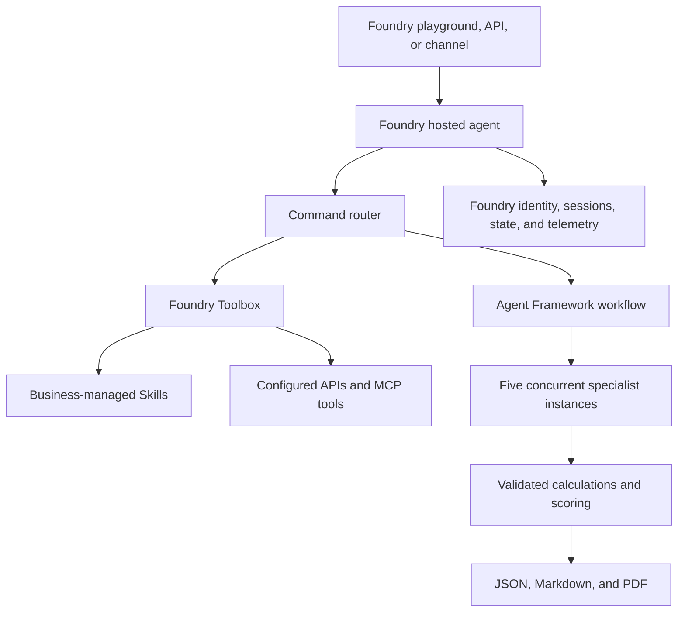

# Microsoft Agent Framework and Foundry Hosted Agent Migration Plan

## 1. Goal

Convert the current Claude Code skill collection into a deployable Python application that:

- uses Microsoft Agent Framework for agent definitions and explicit workflows;
- runs as a containerized hosted agent in Microsoft Foundry Agent Service;
- preserves the existing 14 real-estate commands and five specialist analyses;
- stores business-owned instructions as versioned Foundry Skills that authorized users can update without rebuilding the hosted agent;
- obtains evidence through configurable free APIs, MCP servers, user data, and optional scraping adapters;
- performs financial calculations and scoring in deterministic Python;
- exposes the Foundry Responses protocol for playground, API, and channel clients;
- produces structured JSON, Markdown, and downloadable PDF reports;
- reports sources, freshness, missing data, and confidence for every analysis.

Microsoft Foundry hosts the agent container, endpoint, identity, sessions, conversations, state, scaling, and telemetry. The language model is selected from configured compatible model deployments rather than being fixed to Claude.

## 2. Current-State Assessment

The repository is not currently an executable multi-agent application. It contains:

- `realestate/SKILL.md`: natural-language command router and scoring rules;
- `skills/*/SKILL.md`: 14 command prompts and report templates;
- `agents/*.md`: five specialist prompts with score rubrics and example JSON;
- `scripts/generate_realestate_pdf.py`: the only substantial Python implementation;
- `install.sh` and `uninstall.sh`: Claude Code installation lifecycle;
- `requirements.txt`: ReportLab, Beautiful Soup, and Requests.

Claude Code currently supplies the missing runtime capabilities:

- command interpretation and routing;
- `WebSearch`, `WebFetch`, and `Task` tools;
- concurrent agent execution;
- adaptation when source data is incomplete;
- Markdown file creation and Python script execution.

The migration must implement these capabilities explicitly. Copying the Markdown prompts into agent instructions alone would not produce reliable feature parity.

## 3. Key Design Decisions

### 3.1 Use workflows for the analysis pipeline

The full analysis is a well-defined process, so use a Microsoft Agent Framework workflow rather than a fully autonomous supervisor:

1. Validate and normalize the request.
2. Resolve the property and acquire evidence.
3. Run specialist agents concurrently over the same validated evidence bundle.
4. Validate each structured result.
5. Calculate scores, financial metrics, grade, and signal in Python.
6. Use a synthesis agent only for the narrative recommendation.
7. Render JSON, Markdown, and PDF outputs.

Use `ConcurrentBuilder` for the five independent specialist analyses and a custom aggregator/executor for validation and synthesis. Stream intermediate events to the UI so users can see progress by specialist.

### 3.2 Keep calculations outside the LLM

Move these operations into tested Python services:

- mortgage amortization, PMI, PITI, and refinance break-even;
- NOI, cap rate, cash-on-cash return, GRM, DSCR, and break-even ratio;
- flip and BRRRR calculations;
- comparable-sale adjustments;
- weighted property and comparison scores;
- grade and signal assignment;
- scenario tables and rounding.

Agents should select evidence, explain assumptions, identify risks, and write narratives. They should not be the source of truth for arithmetic.

### 3.3 Make evidence first-class

Every fact used in an analysis should carry:

- source URL and provider;
- retrieval timestamp;
- observation date, where available;
- geographic level and units;
- confidence or quality flag;
- whether it is observed, derived, assumed, or unavailable.

Do not silently replace missing local data with national averages. Defaults must be labeled as assumptions and lower the confidence score.

### 3.4 Put model access behind an adapter

Define one application-level `ChatModelFactory` that creates Microsoft Agent Framework clients from server-side `ModelProfile` configuration. The application must not be tied to Claude or to one vendor.

A model profile should contain:

- stable profile ID and display name;
- provider and model/deployment name;
- endpoint and secret reference;
- supported capabilities: tool calling, structured output, streaming, vision, and context size;
- timeout, token budget, and optional cost metadata;
- whether the profile is enabled for public users.

Support any **configured and compatible** model deployment available to the hosted agent rather than claiming that every model can run the workflow. Prefer models deployed in the Foundry project and authenticated with the hosted agent's managed identity. Third-party and non-Azure Direct models require explicit data-governance, authentication, capability, region, and cost review.

Runtime behavior:

1. Expose enabled model profiles through the agent's configuration/status operation and accept `model_profile_id` in structured requests.
2. Resolve Foundry deployments and project connections only on the server; never accept raw API keys or arbitrary base URLs from users.
3. Validate required capabilities before starting an analysis. The flagship workflow requires reliable structured output; tools may be executed by framework agents or by workflow executors depending on the profile.
4. Allow an optional model profile override per specialist agent, while using one selected profile for all agents by default.
5. Record provider, model, profile version, and prompt version in every result.
6. Fail clearly when a model is unavailable or incompatible, and offer another enabled profile.

Recommended rollout:

1. Prove two different Foundry model deployments locally, including one non-Claude model.
2. Prove runtime switching without changing application code or rebuilding the container when the selected deployment is already authorized.
3. Verify each model's region and tool compatibility before advertising it.
4. Keep all provider-specific credentials and client construction out of domain and workflow modules.

Use `DefaultAzureCredential` for local development and the hosted agent's dedicated managed identity in production. Store any unavoidable third-party credentials in Foundry project connections or an approved secret store, never in the image or skill content.

### 3.5 Deploy as a Foundry hosted agent

Package the Python application as a Linux AMD64 container and host it in Foundry Agent Service. Start from the maintained Microsoft Agent Framework hosted-agent sample and use `agent-framework-foundry-hosting`.

Use the Responses protocol first because it provides OpenAI-compatible requests, streaming, conversations, background execution, and Foundry playground support. The hosting adapter runs locally on port `8088` and exposes readiness automatically; Foundry provides the public endpoint in production.

Hosted-agent responsibilities:

- run the Agent Framework workflow and deterministic services;
- connect to the Foundry Toolbox through `FoundryToolbox` or the supported MCP Resources client;
- use `$HOME` and `/files` for session report artifacts;
- use the Foundry state store for durable application state that should outlive compute;
- emit OpenTelemetry traces to the platform-injected Application Insights connection;
- use the hosted agent identity for models, Toolbox, and authorized Azure resources.

### 3.6 Make business skills editable in Foundry

Hosted-agent code and environment configuration are immutable per deployed agent version. Business-editable behavior must therefore live outside the container as Foundry Skill resources, not as bundled Markdown files.

Create one Foundry Skill for each business capability:

- `realestate-main` for routing language, response standards, and disclaimer wording;
- `realestate-analyze`, `realestate-quick`, `realestate-comps`, `realestate-rental`, `realestate-listing`, `realestate-invest`, `realestate-neighborhood`, `realestate-flip`, `realestate-commercial`, `realestate-mortgage`, `realestate-market`, `realestate-compare`, `realestate-screen`, and `realestate-report-pdf`;
- optional shared skills such as `realestate-brand-voice`, `realestate-assumptions`, and `realestate-compliance`.

Authorized business users receive the least-privilege Foundry role required to manage Skills. In the Foundry Skills UI they can create or upload `SKILL.md`, use **Replace** to create a new immutable version, inspect versions, and change the default version. Attach the skills to a `realestate-business-skills` Toolbox and connect the hosted agent to the Toolbox's unversioned consumer endpoint.

The runtime uses progressive disclosure:

1. Discover skill names and descriptions with MCP `resources/list`.
2. Select the skill for the requested command.
3. Load its active content with `resources/read`.
4. validate the content and combine it with protected system instructions;
5. record the skill name and resolved version in the analysis result and trace.

Use the Microsoft Agent Framework skill provider when available for the selected language/runtime. If the Python SDK does not expose the required convenience provider, implement the same supported MCP Resources flow explicitly rather than bundling the skills into the image.

Foundry Skills and toolbox skill discovery are preview features as of this plan. Validate region, networking, SDK, and UI support before production. The documented UI workflow is currently in the Microsoft Foundry Toolkit Skills tab; verify browser-based Foundry portal support in the target tenant. If business users cannot use that surface, provide a small governed administration page backed by the Foundry Skills API rather than granting them source-code or container access.

### 3.7 Separate editable policy from protected logic

Business users may edit:

- analysis instructions, report wording, tone, and terminology;
- which evidence to emphasize;
- market-specific qualitative guidance;
- disclosure text, subject to compliance approval;
- optional thresholds and weights only through a validated configuration schema.

Business users may not edit through Skills:

- Python financial formulas or score aggregation code;
- Pydantic schemas and validation rules;
- credential handling, endpoints, or RBAC;
- source allowlists, citation requirements, or security controls;
- hard compliance constraints and fair-housing protections.

The hosted agent must prepend protected instructions after loading a skill, validate any editable numeric settings against allowed ranges, and reject skill versions that attempt to override protected controls.

### Business-user publishing workflow

| Step | Owner | Action | Production effect |
|---|---|---|---|
| Author | Business skill author | Open the Foundry Skills UI, edit or upload `SKILL.md`, and create a new immutable version | None |
| Validate | Automated pipeline | Check front matter, allowed sections, token size, prompt-injection patterns, policy rules, and regression examples | None |
| Review | Business approver and compliance reviewer | Compare the candidate with the current default and approve or reject it | None |
| Publish | Authorized publisher | Change the skill's `default_version`; publish a Toolbox version only when its skill membership or pinning changes | New analyses resolve the approved default |
| Observe | Product owner | Review traces, evaluation scores, cost, latency, and user feedback by skill version | None unless rollback is needed |
| Roll back | Authorized publisher | Repoint `default_version` to the previous approved version | New analyses use the prior behavior |

The hosted agent should resolve skill versions at the start of each analysis. An active analysis keeps its original resolved versions for reproducibility; a new analysis receives newly published defaults. Do not allow a mid-run skill change to alter an in-progress report.

## 4. Target Architecture



### Simplified repository layout

```text
src/
  realestate_agent/
    __init__.py
    main.py              # Responses host and application entrypoint
    agent.py             # model factory, command router, and concurrent workflow
    skills.py            # Toolbox skill discovery, validation, and version tracking
    data.py              # Toolbox calls, normalization, caching, and provenance
    models.py            # Pydantic request, evidence, result, and report contracts
    calculations.py      # mortgage, rental, investment, comparison, and scoring math
    reports.py           # JSON, Markdown, and ReportLab PDF output
    config.py            # environment and model-profile settings
skills-baseline/
  realestate-analyze/SKILL.md
  ...                    # source-controlled recovery copies of all Foundry Skills
tests/
  test_calculations.py
  test_skills.py
  test_workflow.py
  test_hosted_agent.py
  evaluation_cases.jsonl
Dockerfile
.dockerignore
.env.example
pyproject.toml
agent.yaml
azure.yaml
README.md
```

### Simplification rules

- Use one hosted agent, not one deployment per command or specialist.
- Use one `agent.py` factory to create specialist instances from Foundry Skill content.
- Treat the 14 commands as routing configuration, not 14 Python classes.
- Keep all deterministic formulas in one module until it becomes difficult to maintain.
- Keep all provider adapters behind `data.py`; split a provider into its own module only when its implementation becomes substantial.
- Use Foundry Toolbox for tools and business skills instead of building a custom administration UI.
- Use Foundry playground and the Responses endpoint instead of creating a separate web application in the first release.
- Keep baseline skills in source control, but load active skills from Foundry at runtime.
- Add a new abstraction only after two real implementations require it.

This structure is intentionally small. It preserves clear boundaries without recreating the current folder-per-prompt layout as folder-per-class Python code.

## 5. Core Data Contracts

Implement Pydantic models before agent wiring. At minimum:

- `AnalysisRequest`: command, address/location, financing assumptions, optional user-supplied facts;
- `PropertyProfile`: normalized address, coordinates, price, physical attributes, taxes, HOA, zoning, and type;
- `EvidenceItem`: value, units, source, dates, confidence, and provenance classification;
- `EvidenceBundle`: property, comps, rentals, neighborhood, market, rates, and provider warnings;
- one typed result for each specialist, based on the JSON examples in `agents/*.md`;
- `FinancialAssumptions`: down payment, rate, term, vacancy, management, maintenance, CapEx, insurance, and appreciation;
- `AnalysisResult`: specialist results, deterministic metrics, composite score, grade, signal, risks, confidence, and citations;
- `ReportArtifact`: content type, filename, storage location, checksum, and expiration.

Validate score ranges, currencies, percentages, dates, and required provenance. Reject or repair malformed agent output before aggregation.

## 6. Data Acquisition Strategy

This is the highest-risk workstream. The current project assumes that listing sites and search results can be queried freely. Production code must not depend on undocumented scraping.

### Free-first provider categories

The initial free stack should target United States properties. Government sources provide the strongest baseline, but community APIs, public MCP servers, open-data portals, and user-supplied data may also be used. Trust is not a prerequisite; provenance and observed reliability determine how much weight a source receives.

| Need | Free source | Access | Reliability and limits |
|---|---|---|---|
| Address normalization and geography | [US Census Geocoder](https://geocoding.geo.census.gov/geocoder/Geocoding_Services_API.html) | Public REST, no application key documented | Official; U.S., Puerto Rico, and Island Areas only; address-range match is not parcel verification |
| Demographics, income, tenure, and population | [Census Data API](https://www.census.gov/data/developers/guidance/api-user-guide.html), primarily ACS | Public REST; use a free Census key for sustained use | Official and versioned; estimates have margins of error and publication lag |
| ZIP-to-tract/county/CBSA mapping | [HUD USPS Crosswalk API](https://www.huduser.gov/portal/dataset/uspszip-api.html) | Free registration token | Official quarterly crosswalk; ZIP codes are not true statistical boundaries |
| Baseline rents and area median income | [HUD Fair Market Rents and Income Limits API](https://www.huduser.gov/portal/dataset/fmr-api.html) | Free registration token | Official annual benchmark; not a live property-specific rent estimate |
| Employment and unemployment | [BLS Public Data API](https://www.bls.gov/developers/) | Public API; free registration key enables broader requests | Official; series geography and release lag must be shown |
| Mortgage rates and macroeconomic series | [FRED API](https://fred.stlouisfed.org/docs/api/fred/) | Free account/API key | Reliable aggregator; preserve original series source, frequency, and revision date |
| House-price trend | [FHFA House Price Index datasets](https://www.fhfa.gov/data/hpi/datasets) | Public JSON/CSV/XML downloads | Official repeat-sales index; suitable for area trends, not individual valuation |
| Disaster history | [OpenFEMA API](https://www.fema.gov/about/openfema/api) | Free REST, no subscription or API key | Official; describes declarations and program datasets, not parcel-level hazard probability |
| Public-school facts | [NCES Common Core of Data](https://nces.ed.gov/ccd/) | Public annual datasets | Official school/district facts; no subjective school rating |
| Nearby amenities | [OpenStreetMap Overpass API](https://wiki.openstreetmap.org/wiki/Overpass_API) | Public community endpoint | Useful for low-volume MVP queries only; no SLA, attribution required, cache results, and self-host or replace for scale |
| Address fallback | [OpenStreetMap Nominatim](https://operations.osmfoundation.org/policies/nominatim/) | Public community endpoint | Maximum 1 request/second, caching and identification required, no autocomplete; not a scalable production dependency |
| Local tax/parcel/sale records | County or city ArcGIS/Socrata open-data portals | Jurisdiction-specific public APIs/downloads | Often authoritative but inconsistent; enable only through tested per-jurisdiction adapters |

### Data that is not reliably free nationwide

Do not promise automatic nationwide coverage for:

- active listings, listing status, price history, or photos;
- property-level sold comparables with complete attributes;
- automated property valuations;
- current property-specific market rent;
- school ratings, address-level crime scores, or Walk Score;
- HOA restrictions, inspection condition, zoning interpretation, or title facts.

For these fields, the free MVP must accept user-entered facts and CSV/JSON comp or rental uploads. Mark missing fields as unavailable, lower confidence, and suppress strong `BUY` or `PASS` recommendations when the evidence threshold is not met. A later licensed provider can implement the same tool contract without changing the workflow.

Community APIs, unofficial wrappers, and scraping adapters may be enabled for prototypes. Keep each source independently configurable and label its output as unverified. Scraping must still respect applicable law, access controls, robots guidance, rate limits, and site terms; do not bypass authentication, CAPTCHAs, or technical restrictions.

### Source tiers

| Tier | Examples | Allowed use | Confidence ceiling |
|---|---|---|---|
| A: official open data | Census, HUD, BLS, FRED, FHFA, FEMA, NCES | Default source for supported facts | High |
| B: community/open source | Public MCP servers, OSM, GitHub-hosted adapters | Production when health-tested and cross-checked | Medium |
| C: unofficial or scraped | Unofficial property APIs, permitted page extraction | Optional enrichment and prototype comps | Low to medium |
| D: user supplied | Form fields, uploaded listing sheets, comp CSV/JSON | Use as declared input and preserve attribution | User supplied |

Conflicting values are not silently merged. Prefer newer direct observations, show material differences, and let the report state which value was used and why.

### Foundry Toolbox and MCP design

Keep external data access behind one `realestate-data` Toolbox:

1. Attach the business-managed Foundry Skills.
2. Add direct OpenAPI tools for sources with a suitable specification, such as OpenFEMA.
3. Add one project-owned `realestate-public-data` MCP server for Census, HUD, BLS, FRED, FHFA, NCES, and carefully rate-limited OpenStreetMap access where direct OpenAPI definitions are unsuitable.
4. Allow additional public or community MCP servers through a configuration allowlist.
5. Add Foundry Web Search as an optional cited research fallback.
6. Enable Toolbox guardrails and Tool Search when the exposed tool count grows beyond a small fixed set.

Public MCP servers may be used, but the application must assume they can change behavior or disappear. Check their tool schema at startup, enforce timeouts and response-size limits, and degrade gracefully. Do not send credentials or unnecessary personal data to them. Normalize every result with source URL, source tier, dataset vintage, observation date, retrieval time, units, and warnings.

Suggested free MCP tool surface:

| MCP tool | Backing source |
|---|---|
| `resolve_us_address` | Census Geocoder |
| `get_acs_profile` | Census ACS |
| `map_zip_geographies` | HUD USPS Crosswalk |
| `get_fair_market_rent` | HUD FMR |
| `get_labor_market` | BLS |
| `get_mortgage_rate_series` | FRED |
| `get_house_price_index` | FHFA HPI |
| `get_disaster_history` | OpenFEMA |
| `get_public_schools` | NCES CCD |
| `get_nearby_amenities` | OpenStreetMap Overpass, MVP only |

The MCP server must perform retrieval only. Financial calculations, scoring, and recommendation rules remain in the hosted agent's tested Python code.

### Reliability rules

- centralize retries, timeouts, rate limits, and circuit breakers;
- cache raw provider responses by provider/query/version;
- set TTL by data type instead of one global TTL;
- deduplicate calls before fan-out so all agents see the same facts;
- retain raw evidence for reproducibility where licensing permits;
- preserve dataset vintage, revision status, and statistical margins of error;
- record source tier and observed success rate for every provider or MCP server;
- reduce confidence when a claim depends only on community, scraped, or unverifiable data;
- never convert regional index data into a parcel valuation without an explicit methodology and warning;
- use provider health checks and return partial results when one source is unavailable;
- identify and attribute OpenStreetMap requests, keep them serial, and respect published usage limits;
- redact addresses and user data from logs by default;
- allow a manual-input mode so the app remains useful without paid APIs.

### Free MVP coverage

The free MVP can reliably provide address normalization, Census geography and demographics, HUD benchmark rents, BLS employment context, FRED mortgage rates, FHFA area price trends, FEMA disaster history, NCES school facts, and limited OSM amenities. It cannot reliably produce a professional appraisal, live listing search, or MLS-quality comps without user-supplied data or a licensed provider.

## 7. Command Migration Map

| Existing command | Target implementation | Delivery phase |
|---|---|---|
| `analyze` | discovery + five-agent concurrent workflow + deterministic synthesis | Milestone 3 |
| `quick` | discovery + deterministic summary + one narrative call | Milestone 3 |
| `mortgage` | deterministic calculator with optional rate lookup | Milestone 1 |
| `report-pdf` | direct import of the ReportLab renderer from typed result data | Milestone 1 |
| `comps` | specialist mode using the shared agent factory and calculator | Milestone 5 |
| `rental` | specialist mode using the shared agent factory and calculator | Milestone 5 |
| `neighborhood` | specialist mode using the shared agent factory | Milestone 5 |
| `invest` | specialist mode using the shared agent factory and calculators | Milestone 5 |
| `market` | specialist mode using the shared agent factory | Milestone 5 |
| `compare` | run two analyses, then deterministic eight-category comparison | Milestone 5 |
| `listing` | listing writer constrained to verified property facts | Milestone 5 |
| `flip` | deterministic rehab/ARV scenarios plus narrative | Milestone 5 |
| `commercial` | commercial schema and NOI mode in the shared engine | Milestone 5 |
| `screen` | provider-backed search and deterministic filtering | Milestone 5 |

Do not implement `screen` as an LLM web search. It needs a property-search provider that supports structured inventory queries.

## 8. Implementation Phases

### Milestone 1: Minimal Python foundation

Deliverables:

- create the simplified package layout shown above;
- add Pydantic request, evidence, specialist-result, and report models;
- move all formulas and score boundaries into `calculations.py`;
- adapt the existing PDF generator to accept `AnalysisResult` directly;
- add focused unit tests using examples from the current skill files;
- set the initial launch geography to the United States;
- use the free-first provider stack in Section 6 and manual input for unavailable property-level data.

Exit criteria: calculations and JSON, Markdown, and PDF rendering pass without an LLM or network.

### Milestone 2: Foundry Skills and Toolbox

Deliverables:

- normalize and upload the 14 current skill files as versioned Foundry Skills;
- create one `realestate-business-skills` Toolbox;
- attach the Skills plus approved Web Search, OpenAPI, or MCP data tools;
- implement `skills.py` to discover and load skills with MCP `resources/list` and `resources/read`;
- implement `data.py` for evidence normalization, provenance, caching, retries, and manual input;
- verify that changing a skill default is visible to a new request without code changes.

Exit criteria: a test request resolves a skill version and produces a validated `EvidenceBundle` with explicit missing-data warnings.

### Milestone 3: Agent workflow and local host

Deliverables:

- create specialist Agent Framework instances from one factory and loaded skill content;
- use `ConcurrentBuilder` with intermediate outputs enabled;
- require typed specialist results and validate them;
- implement deterministic aggregation and a final synthesis agent;
- add per-agent timeout, retry, partial-result, and cancellation behavior.
- wrap the Agent Framework agent with `ResponsesHostServer` from `agent-framework-foundry-hosting`;
- make server mode the default entrypoint and expose `/responses` locally on port `8088`;
- return streaming progress for discovery, each specialist, synthesis, and report generation;
- support model selection and command arguments through a validated request envelope carried by the Responses input;
- include disclaimer acknowledgment and visible data-freshness labels;
- structured error states for invalid address, missing provider credentials, rate limit, timeout, and partial analysis.

Exit criteria: `analyze`, `quick`, `mortgage`, and `report-pdf` work through the local Responses endpoint and Agent Inspector, including partial specialist failure.

### Milestone 4: Deploy and govern

Deliverables:

- add `agent.yaml`, `azure.yaml`, and the Linux AMD64 Dockerfile;
- deploy the image through ACR as a Foundry hosted-agent version;
- use managed identity for Foundry models, Toolbox, state, files, and telemetry;
- keep external credentials in Foundry project connections;
- validate `/readiness`, activation, remote Responses invocation, session resume, files, and traces;
- define Entra groups for skill authors, reviewers, publishers, and read-only users;
- implement the author-review-test-publish-rollback workflow for skill versions;
- record model, agent, Toolbox, and skill versions in each result.

Start with `1 vCPU / 2 GiB` and resize only from Application Insights measurements.

Exit criteria: the hosted version is active, and an authorized business user can publish and roll back a validated skill without redeploying it.

### Milestone 5: Feature parity and release

Deliverables:

- add the remaining command modes using the same router, agent factory, data layer, and calculation engine;
- deterministic unit tests and schema tests;
- golden-report tests for Markdown/PDF sections;
- agent evaluation set covering property types, sparse data, conflicting sources, and provider failures;
- checks for arithmetic consistency, citation coverage, unsupported claims, disclaimer presence, and recommendation calibration;
- prompt and model version recorded in every result;
- privacy, licensing, and security review;
- staged release with usage and cost monitoring.

Exit criteria: all 14 commands meet the definition of done, with no high-severity arithmetic, provenance, privacy, licensing, or fair-housing failures.

## 9. Foundry Runtime Configuration

Suggested variables and secrets:

```text
MODEL_PROFILES_JSON
DEFAULT_MODEL_PROFILE
ALLOW_USER_MODEL_SELECTION
MODEL_DEPLOYMENT_NAME
TOOLBOX_ENDPOINT
CENSUS_API_KEY
BLS_API_KEY
FRED_API_KEY
HUD_API_TOKEN
OSM_USER_AGENT
SEARCH_CONNECTION_NAME
APP_ENV
LOG_LEVEL
REPORT_TTL_HOURS
MAX_CONCURRENT_ANALYSES
SKILL_CACHE_TTL_SECONDS
```

`MODEL_PROFILES_JSON` contains non-secret model deployment metadata. `CENSUS_API_KEY` and `BLS_API_KEY` can be omitted for low-volume calls that fit the providers' unregistered access rules; use registered keys for predictable limits. `FRED_API_KEY` and `HUD_API_TOKEN` require free registration. External API credentials must come from Foundry project connections or an approved secret store. Never expose credentials in UI errors, traces, generated reports, container layers, or skill content.

Example non-secret profile configuration:

```json
[
  {
    "id": "foundry-default",
    "provider": "foundry",
    "model": "configured-deployment",
    "capabilities": ["tools", "structured_output", "streaming"],
    "public": true
  },
  {
    "id": "foundry-alternative",
    "provider": "foundry",
    "model": "configured-alternative-deployment",
    "capabilities": ["structured_output", "streaming"],
    "public": true
  }
]
```

Treat capability declarations as deployment configuration that must be verified by startup or smoke tests, not as assumptions based only on a model name.

Foundry platform-owned variables are read-only and must not be declared or overridden. These include `FOUNDRY_PROJECT_ENDPOINT`, `FOUNDRY_AGENT_NAME`, `FOUNDRY_AGENT_VERSION`, `FOUNDRY_AGENT_SESSION_ID`, `PORT`, `HOME`, and `APPLICATIONINSIGHTS_CONNECTION_STRING`.

Foundry operational constraints to design for:

- hosted-agent versions are immutable; code or environment changes require a new version;
- a single endpoint routes all traffic to one active version, with no traffic splitting;
- each session receives isolated compute and persistent `$HOME`/`/files` state;
- idle compute is deprovisioned and later restored for the same session;
- session files and conversation/state lifetimes are bounded by Foundry policies;
- custom tools must be delivered through the Foundry Toolbox MCP endpoint;
- Skills and skill discovery are preview and do not support private networking at the time of this plan;
- long analyses should use Responses streaming or background mode with cancellation.

## 10. Testing Strategy

### Unit tests

- exact mortgage payment and amortization schedules;
- rental expense scenarios and NOI;
- cap rate, cash-on-cash, GRM, DSCR, BRRRR, and flip ROI;
- weighted scores, grade boundaries, and signal boundaries;
- score validation and missing-dimension behavior;
- filename sanitization and report cleanup.

### Contract and integration tests

- provider response normalization with recorded fixtures;
- malformed, stale, conflicting, and incomplete evidence;
- typed agent output parsing and repair limits;
- model-profile parsing, secret resolution, capability rejection, and default selection;
- equivalent workflow execution against at least two provider profiles;
- skill discovery, content loading, version recording, cache refresh, and fallback behavior;
- candidate-skill validation and rollback to a previous default version;
- concurrent workflow fan-out/fan-in and partial failure;
- PDF generation from a complete and partial result;
- local `/responses` and `/readiness` smoke tests;
- deployed Foundry endpoint, session resume, and background-response tests.

### Agent evaluations

- no unsupported numeric claims;
- every market fact has provenance;
- calculations match deterministic services;
- conservative assumptions are labeled;
- conflicting sources are surfaced rather than averaged silently;
- recommendations remain appropriately cautious when confidence is low;
- protected-class information is not used for housing recommendations or neighborhood steering.

## 11. Security, Legal, and Responsible-AI Controls

- Review every data provider's license, retention rules, and display requirements.
- Do not scrape sites that prohibit automated access.
- Treat an address and analysis history as potentially sensitive user data.
- Do not score neighborhoods using protected classes or proxies for protected classes.
- Remove racial/ethnic composition from investment or desirability scoring.
- Present school, crime, demographic, and safety data as sourced facts with context, not subjective claims about who should live in an area.
- Apply request limits and abuse protection to public deployments.
- Validate URLs and block server-side request forgery in generic fetch tools.
- Sanitize user input before filenames, logs, Markdown, and PDF rendering.
- Keep the financial-advice disclaimer in the UI, API response, Markdown, and PDF.

## 12. Principal Risks and Mitigations

| Risk | Impact | Mitigation |
|---|---|---|
| Property data unavailable or unlicensed | Blocks reliable analysis | Choose provider before coding; support manual input |
| LLM invents values or sources | Financial and reputational harm | Evidence-only prompts, typed outputs, deterministic calculations, citation checks |
| Duplicate provider calls across agents | High cost and rate-limit failures | Acquire and cache one shared evidence bundle before fan-out |
| Five-agent latency and token cost | Slow or expensive hosted-agent sessions | Smaller specialist prompts, concurrency limits, caching, model tiering |
| Agent Framework API changes | Build instability | Pin versions and isolate framework integration behind factories/executors |
| Business skill change breaks behavior | Production regression | Immutable skill versions, automated evaluation, approval, default-version promotion, rollback |
| Skill attempts to override protected controls | Compliance or security failure | Protected code instructions, schema allowlist, validation, rejection, audit trace |
| Preview Skills or Toolbox limitation | Blocks no-deploy editing | Validate region/network/UI early; retain source-controlled skills and a redeploy fallback |
| Session lifetime expires | Lost reports/history | Return downloads immediately; use state store or external storage for retained records |
| Public endpoint abuse | Unexpected model/API cost | Authentication where appropriate, quotas, rate limits, maximum analysis budget |
| Housing discrimination/steering | Legal and ethical exposure | Fair-housing review; exclude protected-class scoring and personalized steering |

## 13. Definition of Done

The conversion is complete when:

- all 14 commands are available through typed API operations and the UI;
- users can choose among enabled model profiles without changing code or rebuilding the hosted agent;
- at least two model providers pass the same workflow contract tests;
- unsupported models are rejected before analysis with a clear capability error;
- the five flagship specialists run through Microsoft Agent Framework workflows;
- the application runs as a Foundry hosted agent through the Responses protocol;
- hosted-agent identity accesses Foundry models and Toolbox without secrets in the image;
- authorized business users can publish and roll back Foundry Skill versions without rebuilding the agent;
- each analysis records the resolved skill, Toolbox, model, prompt, and agent versions;
- all financial and composite calculations are deterministic and tested;
- every material claim includes source and freshness metadata;
- partial data produces a partial, confidence-adjusted report rather than invented facts;
- Markdown and PDF output retain the current disclaimer and major report sections;
- the local container starts on port `8088`, passes `/readiness`, and the deployed version reaches `active`;
- no secret is committed or exposed;
- provider licensing and fair-housing controls are documented and approved;
- latency, per-analysis cost, and failure-rate targets are measured and accepted.

## 14. Recommended First Milestone

Build a thin vertical slice for one manually supplied single-family property:

1. Accept a typed `PropertyProfile` plus a small evidence fixture.
2. Run the five specialist agents concurrently with Microsoft Agent Framework.
3. Validate their typed outputs.
4. Calculate the final score in Python.
5. Render the existing six-page PDF directly from the result model.
6. Serve it through the local Responses hosting adapter and test it in Agent Inspector.
7. Upload one business-editable skill, attach it to the Toolbox, and verify default-version switching.
8. Deploy that slice as a Foundry hosted agent and invoke its dedicated endpoint.

This proves the framework, workflow, report, hosted runtime, managed identity, Toolbox, editable-skill, and deployment paths before the project commits to a property-data vendor. Add live data providers only after the vertical slice is reliable.

## 15. Reference Baseline

This plan is based on the repository state reviewed on 2026-09-16 and the then-current platform guidance:

- Microsoft Agent Framework Python package: `agent-framework`;
- Foundry hosting adapter: `agent-framework-foundry-hosting`;
- Agent Framework concurrent workflow: `ConcurrentBuilder`;
- Foundry hosted-agent protocol: Responses on local port `8088`;
- Foundry hosted-agent deployment: immutable Linux AMD64 container versions in Azure Container Registry;
- Foundry Toolbox consumer endpoint for tools and versioned Skills;
- Foundry-managed identity, sessions, files, state store, and Application Insights telemetry;
- Foundry Skills and toolbox skill discovery are preview features.

Revalidate package APIs, preview status, region and private-network support, Foundry UI capabilities, pricing, and provider terms immediately before implementation.